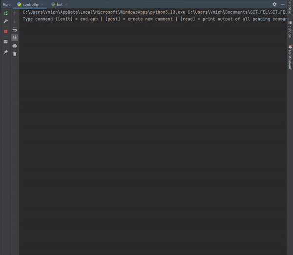
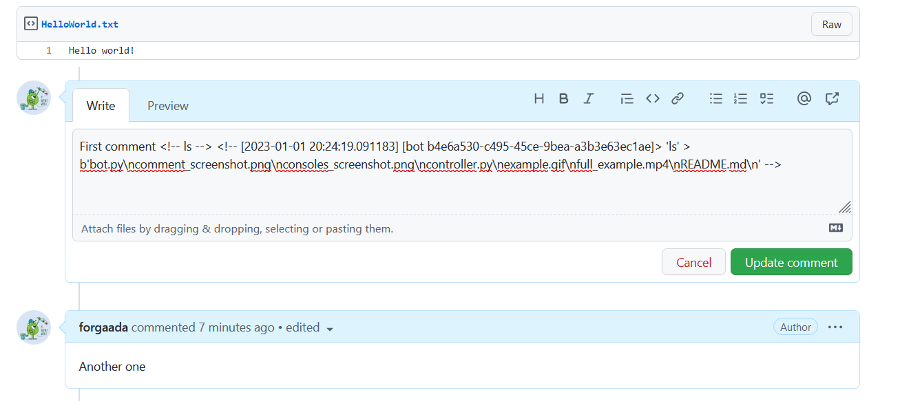
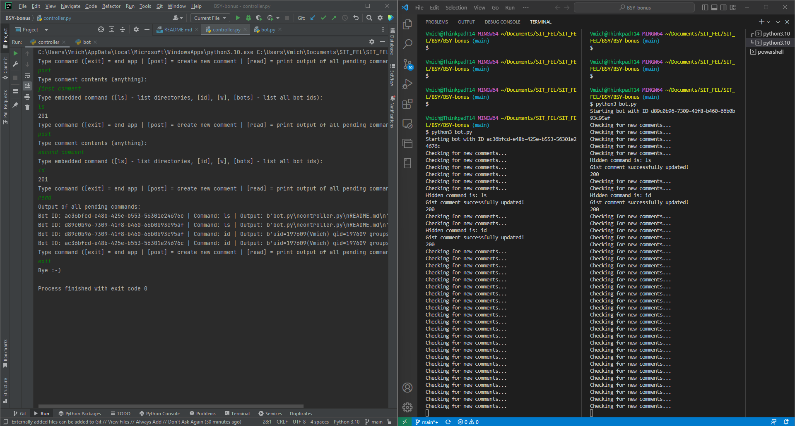

# BSY 2022/2023 Bonus Assignment
This repository serves for purposes of Stage 5 implementation in BSY bonus assignment.

Implementation uses temporary GitHub personal access token (`API_TOKEN` in `bot.py` and `controller.py`).

## How it works?

Bots (`bot.py`) and Controller (`controller.py`) communicate over gist.github.com channel.

Communication is done by creating comments in Gist and embedding hidden commands to a markdown
comment section (e.g.: `<!-- ls -->`). First comment is always containing command for bots
and following comments are outputs from consoles.

Bots are checking new comments from Controller every 1 to 10 seconds (randomized interval due to race
condition issue). After resolving command (using `subprocess` library) output is appended to given comment.

Controller creates new comments (commands for bots) by typing `post` to console. Output for pending commands 
is resolved all at once after typing `read` (it's not automatically). List of all
commands outputs from all bots is then returned. Output contains bot ID, command from controller and
raw bot console output.

Supported commands may differ based on terminal / console where is bot running. For Linux / Bash
should be supported commands like: `ls`, `id`, `w` ..or running code using `./<filename>.exe`.

